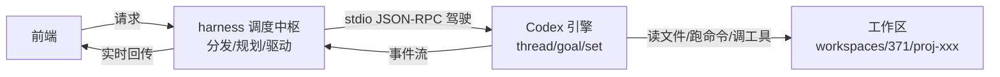
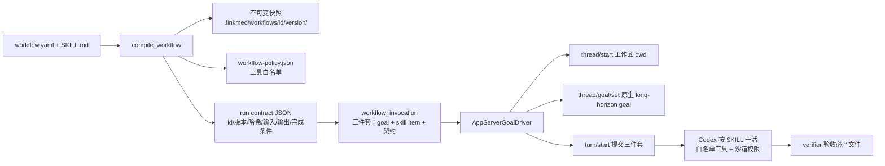

# LinkMed 项目架构梳理（Workflow 专题）

> 基于与 Codex 的项目讨论整理，聚焦整体结构与 workflow 系统。

---

## 1. 项目概览

| 部分 | 技术栈 | 端口 | 位置 |
|---|---|---|---|
| 前端 | Vue3 + Vite | 5173 | `LinkMed-Frontend-Work-Mode` |
| 后端 | FastAPI + harness | 8000 | `ExpeditionDotMed` |
| DeepSeek 代理 | Responses → Chat 代理 | 8899 | 后端 `src/harness/app/proxy.py` |

开发分支：`codex/workflow-packages-v1`（git worktree 方式，与主仓库 `main` 共用对象库，各分支互不影响；codex 二进制通过软链接复用主仓库的构建产物）。

启动（需带 workflow 开关）：

```bash
export PATH="/Users/ficer/Public/Linkmed2/ExpeditionDotMed.worktrees/workflow-packages-v1/.venv/bin:$PATH"
cd /Users/ficer/Public/Linkmed2/LinkMed-Frontend-Work-Mode.worktrees/workflow-packages-v1
LINKMED2_ROOT=/Users/ficer/Public/Linkmed2/ExpeditionDotMed.worktrees/workflow-packages-v1 WORKFLOW_PACKAGES_V1=1 npm run dev:work
```

---

## 2. 三层架构：前端 → harness → Codex 引擎



- **工作区（workspace）** = 材料仓库：`workspaces/<user_id>/<project_id>/`，存放上传文件、agent 产出、`.linkmed/` 元数据。
- **harness** = 调度中枢 + 翻译层（LinkMed 自己实现，`src/harness/`）。一次运行做 6 件事：
  1. **分发**：请求 → workflow 或普通 goal（`harness/planner`）
  2. **分配隔离工作区**（`harness/app/workspaces.py`）
  3. **路由模型**：deepseek 等经本地代理统一成 Responses 协议（`harness/routing`）
  4. **注入跨 run 记忆**（`harness/memory`）
  5. **驱动执行**：`AppServerGoalDriver` 通过 stdio JSON-RPC 驾驶 Codex（`thread/start → turn/start → turn/completed`），goal 用 `thread/goal/set` 设为原生目标，并注入 skill、工具白名单（`harness/runner/app_server.py`）
  6. **收尾**：验证产物、记录 run 摘要
- **Codex（brain）** = 执行引擎：vendored `codex-rs` 编译的 app-server（二进制在 `src/brain/codex-src/codex-rs/target/debug/codex`），只负责"干活"，不懂业务。

> 一句话：Codex 是执行器，业务编排（项目、workflow、chat）全是 harness 做的。

---

## 3. 两套存储：各管各的层，映射表搭桥

| 存储 | 位置 | 管什么 | 谁读写 |
|---|---|---|---|
| `linkmed.db` | `workspaces/linkmed.db` | 业务数据：`user/project/chat/agent_run/document/workflow/run_phase/provenance` + `codex_session` 映射表 | LinkMed（前端界面读的全是这套） |
| `src/.codex`（CODEX_HOME） | 后端 `src/.codex/` | 引擎数据：线程状态（`state_*.sqlite`）、goal（`goals_*.sqlite`）、rollout（`sessions/`）、日志、记忆、tooluniverse MCP 与模型 provider 配置（`config.toml`） | Codex 框架内部 |

- 两套互不读写对方的库，唯一衔接点是 `codex_session` 表的 `codex_thread_id` —— LinkMed 靠它知道"业务 run 对应 Codex 哪个线程"，后续对话用 `thread/resume` 接回。
- `src/.codex` 不是可执行文件，是 `CODEX_HOME`（配置+数据目录）；重定向到项目内是为了隔离平台配置与开发者个人 `~/.codex`，且随项目打包。
- SQLite 是通用技术，不是 Codex 或 OpenAI 的。

---

## 4. Workflow 系统（重点）

### 4.1 workflow 定义：一个包 = 两个文件

```
presets/table-quality-audit/
├── workflow.yaml    # 机器契约（给 harness 看）
└── SKILL.md         # 操作手册（给 Codex 看）
```

`workflow.yaml` 字段说明：

```yaml
format: linkmed.workflow/v1
id: table-quality-audit      # 唯一标识，也是快照目录名
version: 1.0.0               # 作者声明的版本号（语义化：主.次.修订）
title: Table quality audit
skill: SKILL.md              # 关联手册
goal_template: Inspect the supplied table and write a data quality report.
                             # → thread/goal/set 的 objective
inputs:
  required: [project_files]  # 运行前校验项目里必须有文件
outputs:
  required:
    - path: reports/data-quality.md
capabilities:
  allowed_mcp_servers: [linkmed]
  allowed_tools:             # 工具白名单（socket 层强制过滤）
    - preview_table
    - profile_table
permissions:
  workspace_write: true      # 只能在工作区内写
  network: false             # 沙箱禁网
completion:
  required_files:            # 完成条件：必须生成，否则验收失败
    - reports/data-quality.md
```

### 4.2 preset vs 用户 workflow

| | preset（预置工作流） | 用户 workflow |
|---|---|---|
| 存哪 | 代码仓库 `src/harness/workflows/presets/<id>/` | SQLite（`user_workflow` 表） |
| 谁能改 | 无人（前端报 "preset workflows are read-only"） | 创建者 |
| 谁能看 | 所有用户 | 本人 |
| 怎么更新 | 改 YAML + 重启后端（启动时扫描加载） | 前端直接编辑 |
| 优先级 | 高（repository 先查 preset） | 低 |

### 4.3 `src/harness/workflows/` 模块地图

| 模块 | 职责 |
|---|---|
| `models.py` | 数据模型：`WorkflowDefinition`（yaml 的结构化形态）、`WorkflowPackage`（定义 + SKILL + 来源 + content_hash）、`SkillDraft` |
| `yaml_io.py` | yaml ↔ 定义双向转换；渲染规范 yaml（哈希一致性基础） |
| `loader.py` | 启动时扫描 `presets/` 加载包；`content_hash = sha256(规范yaml + SKILL.md)`；拒绝重复 id |
| `repository.py` | 统一查询入口：`get()` 先 preset 后用户包；`list()` 合并 |
| `compiler.py` | 运行前编译：校验输入 → 写不可变快照 → 写工具白名单 policy → 生成 run contract → 产出 `CompiledWorkflowRun` |
| `verifier.py` | 跑完后验收 `completion.required_files` 是否真实生成 |
| `authoring.py` + `authoring_skill/` | `/workflow` 对话式创作：开 Codex session 按规范与你对话，产出定义 |
| `presets/` | 内置包目录（每个子目录一份 yaml + SKILL.md） |

### 4.4 编译与执行链路（点"使用"之后发生什么）



1. **编译**（`compile_workflow`）：校验 `required_inputs` → 快照写入项目 `.linkmed/workflows/<id>/<version>/` → `workflow-policy.json` 写白名单 → 生成 run contract。
2. **构造 invocation**（`workflow_invocation`）：一次原生 Goal/Skill 回合，输入含三个 item：
   - 文本：`Run workflow <id> version <v>.`
   - **skill item**：`{type:"skill", name, path}` → 项目里的 SKILL.md
   - 契约：`<workflow_run>{id、版本、输入、必产输出、完成条件}</workflow_run>`
3. **驱动 Codex**（`AppServerGoalDriver._drive`）：`thread/start`（cwd=项目工作区）→ `thread/goal/set` 激活原生 goal → `turn/start` 提交三个 item。
4. **Codex 内部**：goal 机制让模型持续工作到可验证完成；skill 是操作手册；契约明示输入输出；白名单在 socket 层强制；沙箱禁网；跑完 `verifier` 验收报告文件。

### 4.5 不可变快照与版本管理

- 编译时把当时的 `workflow.yaml` + `SKILL.md` **原样归档**到 `.linkmed/workflows/<id>/<version>/`，并带 `content_hash`（sha256 指纹）。
- 同一 `id@version` 再次运行会**逐字节校验**：内容变了但版本没升 → `workflow snapshot conflict` 拒绝执行。
- 快照**按项目隔离**：每个项目有自己的 `.linkmed/`，A 项目锁定的 1.0.0 不影响 B 项目写入新的 1.0.0。
- **升级规则**：改了内容就升版本（1.0.1 修小错 / 1.1.0 加步骤 / 2.0.0 大改）。升版本后：
  - 新项目、老项目都能跑新版本（新目录无冲突）
  - 老项目历史归档的旧版本**保留、只读、不可回退执行**（repository 只有当前定义，无按版本选择逻辑；想用旧版需从快照导出重新导入）
- 价值：可追溯（每次 run 带 id@version@hash）、可复现（旧快照还在）、项目证据链不被污染。类比 git tag：不改写历史，只发新 tag。

### 4.6 新旧方案对比：文本步骤 vs 契约 + 手册

| | 旧方案（`to_runnable`，开关关） | 新方案（v1，`WORKFLOW_PACKAGES_V1=1`） |
|---|---|---|
| workflow 形态 | `title` + `steps` 纯文本列表 | `workflow.yaml` 契约 + `SKILL.md` 手册 |
| 给 Codex 什么 | 每个 step 一句话直接当 goal 阶段 | goal_template + SKILL skill item + `<workflow_run>` 契约 |
| 工具约束 | 无（模型自由发挥） | 白名单在 socket 层强制 |
| 权限约束 | 无 | 沙箱配置（工作区内写、禁网） |
| 版本/哈希 | 无 | 有（快照、冲突校验） |
| 完成标准 | 无 | `completion.required_files` 验收 |
| 结果 | 模型自由发挥，harness 管不住 | 机器强制约束 + 可追溯 |

### 4.7 为什么 yaml 要独立出来，不塞进 SKILL.md

- **yaml 是"合同"，SKILL.md 是"手册"**：合同要机器强制执行，手册只是模型参考。
- 硬约束必须机器执行：`allowed_tools` 在 socket 层过滤（模型想用别的也调不到）、`network: false` 在 `thread/start` 沙箱配置（想联网也连不上）——写在 md 里只是"建议"，模型可能不遵守。
- 校验要确定性：版本冲突、哈希比对、必产文件验收需要结构化数据，自然语言无法可靠解析。
- 追溯要有指纹：`content_hash` 基于规范结构计算。

---

## 5. 常见概念速查

- **`.linkmed/`**：每个项目工作区的内部元数据目录（`workflows/<id>/<version>/` 快照、`workflow-policy.json`）。隐藏且被 `_project_files()` 过滤，前端文件树和 Codex 都看不到，由 harness 维护。
- **`workspaces/371/`**：`371` 是用户 ID，项目在 `workspaces/<user>/<project_id>/` 下各自独立。
- **SQLite**：通用嵌入式数据库，LinkMed 用它存业务数据，Codex 也用它存线程状态，两者无关。
- **git worktree**：主仓库 `main` 与 `codex/workflow-packages-v1` 等是同一仓库的不同 checkout，共享对象库、分支互不影响；codex 二进制软链接复用主仓库构建产物。
- **`CODEX_HOME`（src/.codex）**：Codex 的配置+数据目录，不是可执行文件；可执行文件在 `src/brain/codex-src/codex-rs/target/debug/codex`。
