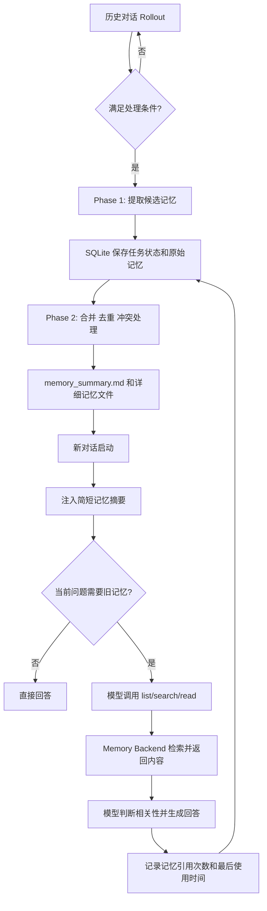
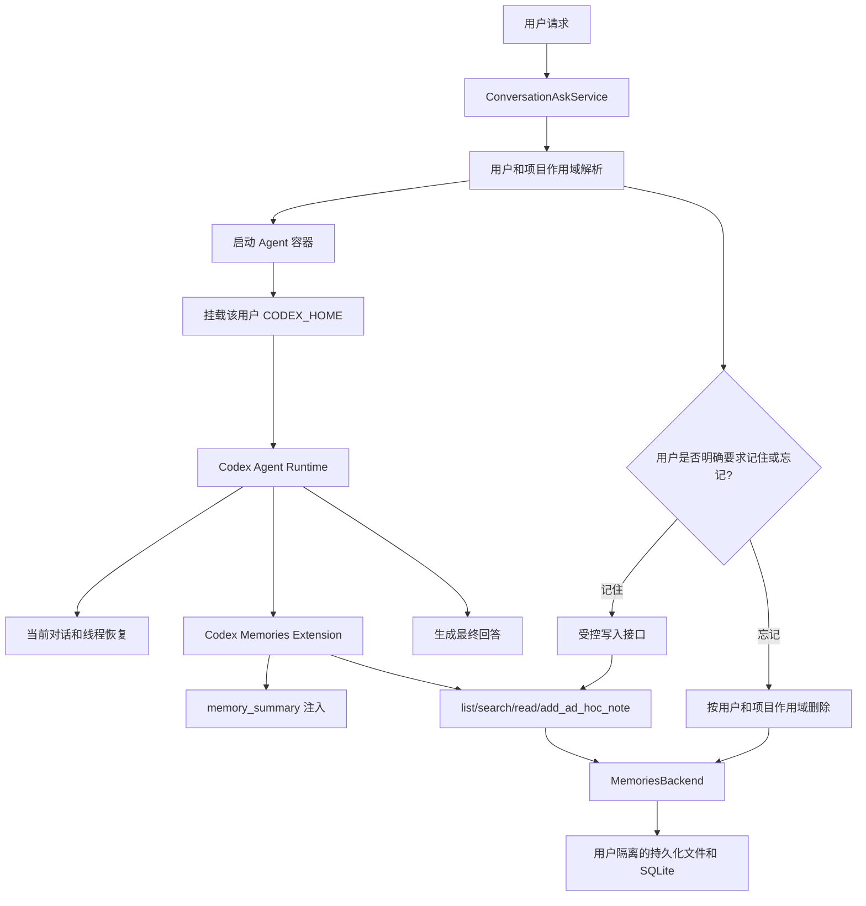
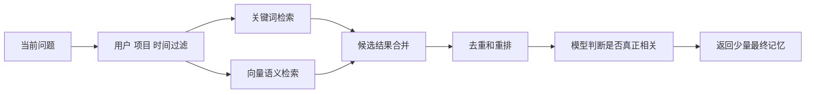

# Codex 原生 Memories：工作机制与 LinkMed 接入思路

> 整理日期：2026-07-17  
> 文档性质：基于现有 Codex Memories 调研回复重新梳理的技术说明  
> 适用场景：GitHub README、架构设计文档、内部技术评审

> [!NOTE]
> 本文重点讨论 Codex 原生 Memories 的工作方式，以及 LinkMed 如何在不重复开发整套记忆系统的前提下完成接入。原始材料中与 Lenovo 网站访问有关的一条回复与主题无关，因此未纳入正文。

---

## 1. 核心结论

Codex 原生 Memories 已经具备一条较完整的记忆链路：

- 从历史对话中提取可复用信息；
- 对零散记忆进行合并、去重和冲突处理；
- 将任务状态和中间结果保存在本地 SQLite；
- 将整理后的记忆写入摘要和详细记忆文件；
- 在新对话启动时只注入简短摘要；
- 由模型在需要时调用 `list`、`search`、`read` 等工具读取详细记忆；
- 对敏感信息、过期记忆和使用频率进行控制。

因此，LinkMed 没有必要重新开发一套“候选记忆提取 + 向量库 + 关键词匹配 + 提示词拼接”的完整系统。

更合理的方向是：

1. **把 Codex 原生 Memories 作为记忆底座；**
2. **为每个用户持久化并隔离 Codex Home；**
3. **先关闭 LinkMed 旧记忆的自动提示词注入；**
4. **在原生机制外补一层很薄的用户、项目和显式记忆控制；**
5. **未来再根据规模替换存储或增加混合检索。**

一句话概括：

> **Codex 负责记忆的提取、整理、搜索工具和上下文注入；LinkMed 负责用户隔离、持久化、作用域和产品控制。**

---

## 2. 版本状态需要分开理解

调研过程中出现过 `UnderDevelopment` 和 `Stable` 两种结论，原因是核对的源码版本不同。

| 对象 | 状态 | 说明 |
|---|---|---|
| LinkMed 当前使用的较早 7 月代码快照 | `UnderDevelopment` | 功能存在，但仍被视为开发中能力 |
| 2026-07-17 左右的 Codex 上游 `main` | `Stable` | 功能等级已提升，但默认仍关闭 |
| 是否默认启用 | 否 | 仍需要显式开启 `memories` |
| 是否适合立即全量上线 | 不建议直接全量 | 仍需验证多用户隔离、持久化和产品控制 |

因此，不能只问“Codex Memory 是否已经做好”，而应拆成三个问题：

1. **官方是否已经实现完整主链路？** 已实现。
2. **是否已经可以运行和测试？** 可以。
3. **是否可以不做任何适配就直接用于 LinkMed 多用户生产环境？** 不可以。

LinkMed 仍然需要补齐：

- 用户级存储隔离；
- 容器重建后的持久化；
- 用户和项目作用域；
- “记住 / 忘记”的产品入口；
- 与旧 MySQL 记忆系统的冲突处理。

---

## 3. 整体工作链路



这条链路有两个重要特征：

### 3.1 不是每说一句就立即写入长期记忆

Codex 会等待对话空闲，并筛选符合条件的历史 Rollout，再异步执行记忆提取。

默认策略大致包括：

- 跳过仍在活跃的对话；
- 跳过过短或不符合要求的对话；
- 只处理一定时间范围内的历史对话；
- 每次启动只处理有限数量的任务；
- 后台执行，不阻塞当前用户对话。

### 3.2 新对话不会注入全部历史记录

新对话只会先获得压缩后的记忆摘要。只有在当前问题确实相关时，模型才进一步搜索和读取详细记忆。

```text
简短摘要负责导航
        ↓
模型判断当前问题是否相关
        ↓
相关时调用 search/read
        ↓
只读取命中的详细记忆
```

这比“每次对话都把所有历史记忆拼进 Prompt”更可控，也更节省上下文。

---

## 4. 写入链路：记忆如何生成

## 4.1 启动条件

记忆后台任务的入口是 `start_memories_startup_task`。

启动前会检查：

- Memory 功能是否开启；
- 当前是否为主智能体；
- 当前会话是否为临时会话；
- Codex 本地 SQLite 是否可用；
- 是否存在符合空闲时间和处理条件的历史 Rollout。

满足条件后，Codex 通过后台异步任务执行记忆整理，不阻塞当前对话。

## 4.2 Phase 1：从单个历史对话提取信息

Phase 1 的目标不是直接生成最终长期记忆，而是从每个符合条件的历史对话中提取结构化中间结果。

典型输出包括：

| 字段 | 作用 |
|---|---|
| `raw_memory` | 从该对话提取出的可复用信息 |
| `rollout_summary` | 该对话完成了什么 |
| `rollout_slug` | 简短标识，便于组织和定位 |
| 来源线程 | 记录记忆来自哪个对话 |
| 更新时间 | 用于后续筛选、合并和衰减 |

模型在这一阶段负责判断：

- 哪些内容值得长期保留；
- 哪些只是当前任务的临时信息；
- 哪些信息可能包含敏感内容；
- 哪些内容需要被规范化为便于后续检索的描述。

## 4.3 SQLite：任务状态与中间结果

Codex 使用自己的本地 SQLite，而不是 LinkMed 的业务 MySQL。

SQLite 主要保存：

- 等待处理的历史对话；
- 正在执行、成功或失败的记忆任务；
- Phase 1 的原始提取结果；
- 某条记忆被引用的次数；
- 记忆最后一次被使用的时间；
- 某个对话是否允许贡献记忆；
- 某个对话是否禁止使用记忆；
- 记忆污染或异常状态。

这意味着，Codex Memories 不只是若干 Markdown 文件，还依赖本地状态数据库维护完整生命周期。

## 4.4 Phase 2：合并成稳定长期记忆

Phase 2 会从 SQLite 中选择较新、较有价值或使用频率较高的 Phase 1 结果，并启动一个受限的内部整理任务。

该阶段负责：

- 合并重复信息；
- 处理表达不同但含义相同的内容；
- 识别新旧冲突；
- 用较新的有效信息覆盖旧信息；
- 将零散信息整理为结构清晰的长期记忆；
- 生成简短的 `memory_summary.md`；
- 保存更详细的记忆和历史摘要。

内部整理任务通常受到严格限制：

- 默认不能联网；
- 不能递归启动其他智能体；
- 只能访问和修改记忆工作区；
- 输出必须符合规定的记忆结构。

这也是原生机制比“发现一句信息就直接插入数据库”更成熟的地方：它有专门的二次合并阶段，而不是简单堆积事实。

---

## 5. 读取链路：新对话如何使用记忆

## 5.1 启动时只注入记忆摘要

App Server 创建新线程时，会安装 Memories 扩展。

该扩展读取并截断 `memory_summary.md`，将一份较短的记忆索引加入开发者上下文，而不是加载全部历史对话和所有详细记忆。

这样可以保证：

- 当前用户问题仍然是最高优先级；
- 记忆只作为补充信息；
- 不相关历史不会长期占用上下文；
- 详细内容只有在需要时才读取。

## 5.2 专用记忆工具

Codex 可以向模型提供以下专用工具：

| 工具 | 作用 |
|---|---|
| `list` | 列出可用记忆文件或记忆分类 |
| `search` | 根据搜索词定位相关记忆 |
| `read` | 读取命中的具体记忆内容 |
| `add_ad_hoc_note` | 显式增加一条记忆 |

典型调用流程如下：

```text
当前用户问题
    ↓
模型判断是否需要历史记忆
    ↓
模型生成搜索词
    ↓
search 返回候选片段
    ↓
read 读取具体内容
    ↓
模型判断内容是否真的相关
    ↓
将有效记忆用于回答
```

## 5.3 使用统计形成反馈

当某条记忆被使用后，系统会记录：

- 引用次数；
- 最后使用时间；
- 来源线程；
- 后续合并时的优先级参考。

长期不使用、时间较旧或价值较低的记忆，会逐渐失去参与后续合并的资格。

---

## 6. Codex 当前并不依赖向量库

Codex 原生 Memories 当前的默认实现没有生成 Embedding，也没有接入向量数据库。

实际链路更接近：

```text
模型理解历史对话
    ↓
模型提取并规范化重要信息
    ↓
模型合并为摘要和详细记忆
    ↓
当前模型根据问题生成多个搜索词
    ↓
Memory Backend 做文本匹配
    ↓
模型读取结果并判断是否相关
```

本地搜索主要采用：

- 子字符串匹配；
- 大小写归一化；
- 字符归一化；
- 任一关键词命中；
- 同一行全部关键词命中；
- 一定行窗口内多个关键词共同命中。

它之所以仍然表现出一定的“语义检索”能力，主要来自模型参与了写入和查询两个阶段：

1. 写入时，模型将复杂长对话整理成更规范、更容易检索的记忆；
2. 读取时，模型根据当前问题主动生成更合适的搜索词。

因此可以概括为：

> **模型负责理解和组织，关键词搜索负责快速定位，文件负责保存内容。**

而不是：

> 将所有对话切块、向量化、存入向量库，再按相似度召回。

---

## 7. 哪些工作依赖模型，哪些不依赖

## 7.1 高度依赖模型的部分

记忆写入阶段高度依赖模型：

```text
历史对话
    ↓
提取模型判断哪些内容值得记忆
    ↓
整理模型处理重复、冲突和覆盖关系
    ↓
生成摘要与详细记忆
```

模型负责：

- 重要性判断；
- 信息分类；
- 冲突处理；
- 新旧覆盖；
- 摘要生成；
- 结构化输出。

Codex 可以为提取阶段和合并阶段分别指定模型，不一定使用当前聊天的主模型。

## 7.2 部分依赖模型的读取阶段

读取过程可以拆成四步：

| 步骤 | 执行方 | 是否消耗模型推理 |
|---|---|---|
| 注入 `memory_summary` | Codex 框架 | 否 |
| 判断是否需要旧记忆并生成搜索词 | 当前 Agent 模型 | 是 |
| 执行文本搜索和文件读取 | Memory Backend | 否 |
| 判断结果是否相关并用于回答 | 当前 Agent 模型 | 是 |

因此最准确的描述是：

> **模型负责理解、选择和整理；Codex 框架负责存储、检索和传递。**

---

## 8. “本地记忆”在线上部署中存放在哪里

“本地”是相对于 Codex 运行环境而言，不一定是终端用户的电脑。

| Codex 运行位置 | Memories 实际存储位置 |
|---|---|
| 用户电脑上的 Codex Desktop / CLI | 用户电脑 |
| LinkMed 服务器进程 | LinkMed 服务器 |
| 临时 Agent 容器 | 容器内部临时文件系统 |
| 挂载持久卷的 Agent 容器 | LinkMed 的持久化磁盘或共享存储 |

如果 Codex 运行在临时容器中，而没有挂载持久化目录，那么容器被删除后：

- 对话线程状态会丢失；
- SQLite 任务和使用记录会丢失；
- Memory 文件会丢失；
- 新容器会像第一次启动一样没有记忆。

因此线上正确做法是为每个用户准备独立的持久化 Codex Home。


这不是端口映射，也不需要向公网暴露记忆文件。本质上只是持久化磁盘挂载。

可以把它理解为：

> 容器是临时办公室，用户的持久化 Codex Home 是档案柜。

---

## 9. LinkMed 当前需要解决的核心问题

## 9.1 Codex Home 没有完整持久化

如果 Agent 容器删除后没有重新挂载同一份 Codex Home，即使 Memory 功能已经开启，下一次启动仍然会失忆。

需要持久化的不只是最终 Markdown 记忆文件，还包括：

- 线程记录；
- Rollout；
- 检查点；
- 本地 SQLite；
- 记忆摘要；
- 详细记忆文件；
- 记忆任务状态；
- 使用统计。

## 9.2 两套记忆同时注入会产生冲突

如果同时启用：

```text
LinkMed 自建 MySQL 记忆自动注入
                +
Codex 原生 Memories 自动注入
```

模型会收到两份来源不同、更新规则不同、作用域不同的历史信息。

可能出现：

- 重复记忆；
- 新旧事实冲突；
- 当前任务被旧任务干扰；
- 不同项目之间串信息；
- 难以判断问题来自哪一套系统。

因此，在测试原生 Memories 时，建议先停止旧系统的自动 Prompt 注入，但暂时保留 MySQL 表和历史数据，便于回滚或迁移。

## 9.3 原生自动学习与 LinkMed 产品规则不完全一致

Codex 原生模式在 `generate_memories = true` 时，会自动从符合条件的历史对话中提取记忆。

但 LinkMed 当前更偏向严格规则：

> 用户明确说“记住”才写入，明确说“忘记”才删除。

两种策略存在差异：

| 策略 | 优点 | 风险 |
|---|---|---|
| 原生自动提取 | 使用自然、实现成本低、能自动积累 | 可能记住用户没有明确要求保存的内容 |
| 严格显式记忆 | 可控、容易解释、符合产品承诺 | 需要增加产品入口和控制层 |

因此，正式上线更适合采用“原生内核 + 薄控制层”。

---

## 10. 推荐的 LinkMed 目标架构



### 职责划分

| 模块 | 主要职责 |
|---|---|
| Codex 原生 Memories | 提取、合并、摘要、搜索工具、读取工具、使用统计 |
| LinkMed 后端 | 用户身份、项目身份、权限、容器调度、持久卷挂载 |
| 薄控制层 | 记住、忘记、作用域、开关、审计 |
| MySQL | 保存用户、对话、项目与存储标识的映射，不必重复存放全部原生记忆 |
| 持久化存储 | 保存每个用户独立的 Codex Home |

---

## 11. 推荐的作用域设计

为了避免记忆压过当前任务，建议将上下文按优先级分层：

```text
当前用户消息
    > 当前对话上下文
    > 当前线程检查点
    > 当前项目记忆
    > 显式用户长期记忆
    > 其他历史信息
```

至少划分三类持久信息：

| 作用域 | 示例 | 使用规则 |
|---|---|---|
| 用户全局记忆 | 输出偏好、长期身份设定 | 可跨项目使用，但只注入少量稳定内容 |
| 项目记忆 | 某个研究项目的约束、术语和决策 | 只有进入对应项目时才允许检索 |
| 对话 / 线程状态 | 当前任务进度、尚未完成的步骤 | 只用于恢复当前线程，不应升级为全局记忆 |

推荐原则：

- 当前对话永远高于历史记忆；
- 项目记忆不能跨项目召回；
- 普通任务细节不能自动变成用户全局偏好；
- 引用历史记忆前必须经过作用域过滤；
- 用户可以查看、关闭、删除自己的记忆；
- 删除操作应同时清理摘要、详细文件和对应索引状态。

---

## 12. 两种可实施方案

## 12.1 方案 A：纯原生试验版

开启 Codex 原生的自动生成和读取能力，让内部测试用户直接体验官方完整链路。

```text
历史对话
    ↓
Codex 自动提取
    ↓
Codex 自动合并
    ↓
新对话自动使用摘要并按需搜索
```

适合：

- 小范围内部测试；
- 验证原生 Memory 的准确率；
- 观察是否会把旧任务错误带入新对话；
- 评估模型调用成本。

不足：

- 不符合严格的“用户明确说记住才记”；
- 产品可解释性较弱；
- 自动提取的边界需要大量测试。

## 12.2 方案 B：原生内核 + 薄控制层

关闭普通对话的自动记忆生成，只保留原生读取、整理和存储能力；当用户明确要求记住时，再调用受控写入接口。

```text
普通对话
    ↓
不自动贡献长期记忆

用户说“请记住……”
    ↓
LinkMed 判断用户和项目作用域
    ↓
调用 add_ad_hoc_note 或受控写入接口
    ↓
交给 Codex 原生记忆链路保存和整理
```

这是正式上线更推荐的方向，因为它同时保留：

- Codex 原生的记忆结构；
- 原生搜索和读取工具；
- 原生摘要注入；
- LinkMed 自己的产品控制权。

---

## 13. 分阶段落地路线

## 阶段 0：停止继续扩展旧自动记忆系统

目标：避免两条路线继续并行膨胀。

- 保留现有 MySQL 表和代码；
- 停止新增候选记忆提取器；
- 停止扩大关键词自动注入范围；
- 将旧系统降级为可回滚的历史实现。

## 阶段 1：先完成线程和 Codex Home 持久化

目标：先解决“关闭网页或重建容器后还能继续原对话”。

- 每个用户创建独立存储目录；
- 将目录挂载为对应 Agent 的 `CODEX_HOME`；
- 保存线程、Rollout、SQLite 和检查点；
- 在 MySQL 中记录 `user_id`、`conversation_id`、`project_id` 与存储标识的映射；
- 验证容器删除和重建后的恢复能力。

这一阶段即使暂时不开启 Memories，也能先获得稳定的会话恢复能力。

## 阶段 2：小范围开启原生 Memories

目标：验证官方链路是否满足实际需求。

- 仅给内部测试账号开启；
- 关闭 LinkMed 旧记忆的自动注入；
- 记录记忆提取准确率；
- 测试跨对话召回；
- 测试错误记忆、冲突记忆和过期记忆；
- 测试不同用户之间是否完全隔离；
- 评估后台提取和合并的模型成本。

## 阶段 3：增加显式记忆控制

目标：满足正式产品规则。

建议增加以下产品接口：

```text
remember(userId, projectId?, content)
forget(userId, projectId?, memoryId | query)
listMemories(userId, projectId?)
setMemoryEnabled(userId, enabled)
setConversationMemoryPolicy(conversationId, use, contribute)
```

这些接口只负责权限和作用域，底层仍可复用 Codex 的 `add_ad_hoc_note`、摘要、合并和读取逻辑。

## 阶段 4：根据规模替换存储后端

当用户规模扩大或部署到多台服务器后，可以实现自定义 `MemoriesBackend`：

```text
Codex Memories 工具接口
        ↓
自定义 MemoriesBackend
        ↓
数据库全文检索 + 对象存储 + 可选向量检索
```

由于 Codex 已经将“记忆逻辑”和“实际存储位置”抽象开，后续可以逐步替换底层，而不需要推翻 Agent 侧的 `list/search/read` 调用方式。

---

## 14. 向量检索应该什么时候加入

现阶段 LinkMed 的主要问题是：

> **不相关历史被错误注入，而不是相关记忆完全搜索不到。**

过早接入向量库可能召回更多“语义相似但不应该使用”的旧内容，反而扩大串记忆风险。

建议只有在以下条件出现时再增加向量检索：

- 单个用户记忆规模明显增大；
- 关键词和历史表达差异很大；
- 经常出现同义表达无法命中；
- 项目和时间过滤已经足够严格；
- 有稳定的重排和相关性判断机制。

成熟的后续方案可以是混合检索：



向量库应被视为可替换的检索增强层，而不是记忆系统本身。

---

## 15. 风险与测试重点

| 风险 | 需要验证的内容 |
|---|---|
| 用户串记忆 | 两个用户是否可能挂载到同一 Codex Home |
| 项目串记忆 | 项目 A 的内容是否会在项目 B 被召回 |
| 自动记错 | 模型是否把文档内容误认为用户个人信息 |
| 冲突覆盖错误 | 新信息和旧信息冲突时是否正确更新 |
| 敏感信息泄漏 | 密钥、隐私和内部数据是否被写入长期记忆 |
| 容器销毁丢失 | 重建容器后线程、SQLite 和记忆文件是否完整恢复 |
| 双系统冲突 | 旧 MySQL 注入是否已彻底关闭 |
| 上下文污染 | 记忆摘要是否压过当前用户指令 |
| 成本不可控 | Phase 1、Phase 2 的模型调用量是否可接受 |
| 删除不完整 | 用户执行忘记后，摘要、详细内容和索引是否同步删除 |

推荐优先完成以下测试：

1. 同一用户跨容器恢复；
2. 两个用户完全隔离；
3. 同一用户两个项目隔离；
4. 用户修改姓名或偏好后的冲突合并；
5. 文档人物信息不被误记为用户信息；
6. 用户明确忘记后的彻底删除；
7. 当前问题与历史记忆冲突时，以当前问题为准；
8. Memory 关闭时不读取也不贡献记忆。

---

## 16. 最终建议

当前最稳妥的路线不是重新建设完整 Memory Service，也不是立即全量打开原生自动记忆。

建议顺序如下：

```text
先持久化 Codex Home 和线程状态
        ↓
小范围试验 Codex 原生 Memories
        ↓
关闭 LinkMed 旧记忆自动注入
        ↓
增加显式“记住 / 忘记”和作用域控制
        ↓
正式上线原生内核 + 薄控制层
        ↓
规模扩大后再替换 MemoriesBackend
        ↓
必要时增加关键词 + 向量混合检索
```

最终目标应当是：

> **尽可能复用 Codex 原生记忆算法，只在 LinkMed 产品层补充持久化、用户隔离、项目边界、显式控制和审计能力。**

---

## 17. 相关源码与文档

### 官方文档

- [Codex Memories 官方说明](https://developers.openai.com/codex/memories)

### 功能与配置

- [Codex Features](https://github.com/openai/codex/blob/main/codex-rs/features/src/lib.rs)
- [Memories Config Types](https://github.com/openai/codex/blob/main/codex-rs/config/src/types.rs)

### 写入链路

- [Memories Startup Task](https://github.com/openai/codex/blob/main/codex-rs/memories/write/src/start.rs)
- [Phase 1 Extraction](https://github.com/openai/codex/blob/main/codex-rs/memories/write/src/phase1.rs)
- [Phase 2 Consolidation](https://github.com/openai/codex/blob/main/codex-rs/memories/write/src/phase2.rs)
- [Prompt Assembly](https://github.com/openai/codex/blob/main/codex-rs/memories/write/src/prompts.rs)
- [Memory Templates](https://github.com/openai/codex/tree/main/codex-rs/memories/write/templates/memories)
- [Storage Synchronization](https://github.com/openai/codex/blob/main/codex-rs/memories/write/src/storage.rs)
- [Memory Workspace](https://github.com/openai/codex/blob/main/codex-rs/memories/write/src/workspace.rs)
- [Memory Runtime](https://github.com/openai/codex/blob/main/codex-rs/memories/write/src/runtime.rs)

### 状态数据库

- [Memory Runtime State](https://github.com/openai/codex/blob/main/codex-rs/state/src/runtime/memories.rs)
- [Memory Migration 0006](https://github.com/openai/codex/blob/main/codex-rs/state/migrations/0006_memories.sql)
- [Memory Usage Migration 0016](https://github.com/openai/codex/blob/main/codex-rs/state/migrations/0016_memory_usage.sql)

### 读取与工具

- [Memories Extension](https://github.com/openai/codex/blob/main/codex-rs/ext/memories/src/extension.rs)
- [App Server Extensions](https://github.com/openai/codex/blob/main/codex-rs/app-server/src/extensions.rs)
- [Memory Prompt Injection](https://github.com/openai/codex/blob/main/codex-rs/ext/memories/src/prompts.rs)
- [Memory Tools](https://github.com/openai/codex/tree/main/codex-rs/ext/memories/src/tools)
- [Search Tool](https://github.com/openai/codex/blob/main/codex-rs/ext/memories/src/tools/search.rs)

### 存储后端

- [MemoriesBackend](https://github.com/openai/codex/blob/main/codex-rs/ext/memories/src/backend.rs)
- [LocalMemoriesBackend](https://github.com/openai/codex/blob/main/codex-rs/ext/memories/src/local.rs)
- [Local Search Implementation](https://github.com/openai/codex/blob/main/codex-rs/ext/memories/src/local/search.rs)
